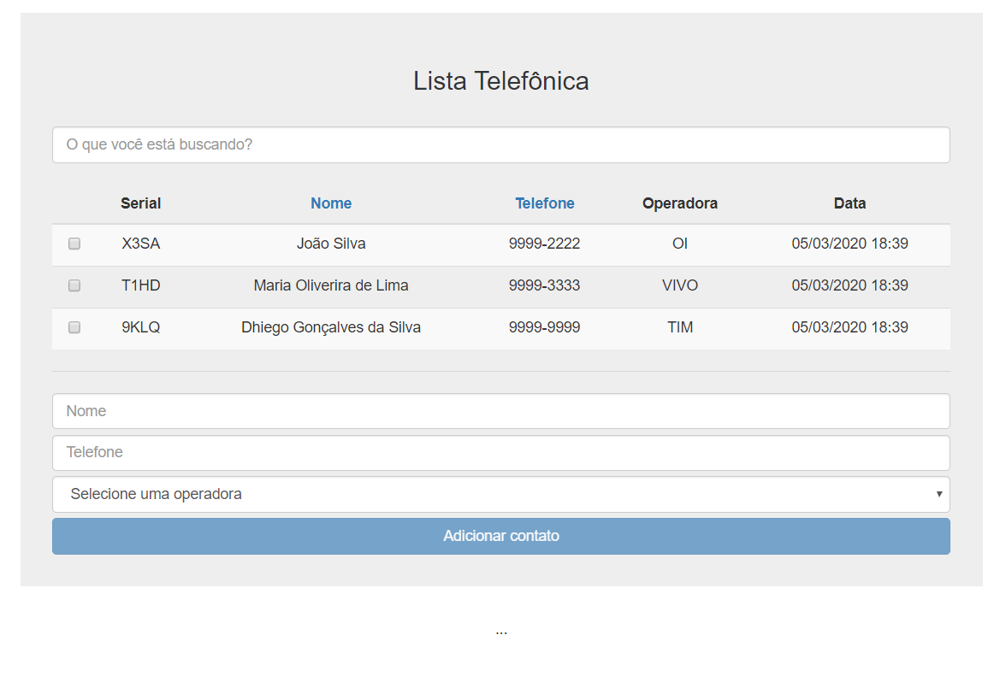

# PHONE BOOK - ANGULARJS

> Lista Telefônica criado com AngularJS.

## Image

<p align="center">
     
</p>

## Iniciar a aplicacão :checkered_flag:

Acesse a pasta `server` e execute o comando abaixo para iniciar o servidor:

```console
node server
```

Em seguida, execute o arquivo `index.html` para ter acesso a aplicação.
